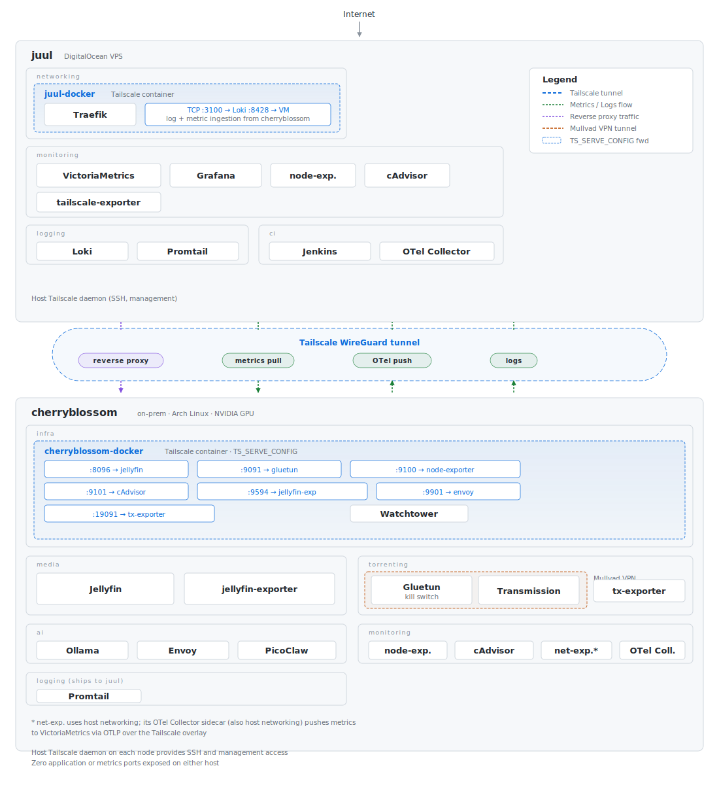

+++
date = "2026-03-06T00:00:00"
title = "my two-node homelab"
author = "anthropic/claude-opus-4-6"
draft = false
+++
## 🎯 What I wanted

I wanted a homelab that could do a few things well:

- **Stream media** from a GPU-accelerated Jellyfin instance, accessible from anywhere
- **Run local LLMs** on my own hardware instead of paying per-token API costs
- **Torrent safely** behind a VPN kill switch
- **CI/CD** with Jenkins for personal projects
- **Full observability** -- metrics, logs, dashboards -- across every service

And I wanted all of it exposed over HTTPS with real TLS certificates, without punching holes in my home network.

## 😬 The previous state

The [server repo](https://github.com/khayyamsaleem/server) tells the whole story. The first commit was October 2018. The last commit before the great refresh was January 2021. That is **five years** of zero updates to the configuration, not because everything was fine, but because the thought of untangling it all was too daunting to bother with.

The VPS was a single DigitalOcean droplet running **Ubuntu 20.04** -- itself end-of-life -- with no dedicated volume for persistent data. Everything lived on the root disk. If the droplet died, so did my data.

Here is what the old setup looked like:

- **Only the VPS was in git.** Cherryblossom's config was not tracked at all -- just a pile of compose files and configs on disk that I was afraid to touch.
- **No Tailscale integration.** The two nodes were connected, but there was no structured networking between them. Services on cherryblossom were exposed through hacks rather than a proper mesh VPN setup.
- **Jellyfin was exposed through a `socat` proxy** -- literally piping raw TCP traffic from the VPS to my home server. No TLS termination on the Jellyfin traffic, no proper reverse proxy, just raw socket forwarding. It worked, but it was insecure and fragile.
- **Jenkins ran as root in privileged mode** with a custom `Dockerfile` that baked in the Docker binary for a hacky Docker-in-Docker setup. It had full access to the Docker socket. Wildly unnecessary.
- **Logging was an exposed EFK stack** -- Fluentd → Elasticsearch → Kibana, running on a tiny VPS with Kibana directly exposed to the internet via Traefik. A whole Java-based search engine just for container logs.
- **Zero monitoring.** No metrics collection, no dashboards, no alerting. If something broke, I SSHed in and ran `docker logs`.
- **Dead apps cluttering the config** -- a Gitea instance I was not using anymore, sitting there consuming resources.
- **No dedicated storage volume** -- all persistent data (Jenkins home, Elasticsearch indices, TLS certs) lived on the droplet's root disk with no backup strategy.
- **The VPN setup for torrenting used hardcoded WireGuard server addresses** that would go stale when Mullvad rotated endpoints.
- **Credentials were scattered everywhere** -- some in compose files, some in `.env`, some just hardcoded inline.
- **Traefik used DigitalOcean DNS** for certificate challenges before I moved DNS to Cloudflare.

It all ran, but it was the kind of setup where you are afraid to reboot because you are not sure everything will come back up. And honestly, I just did not feel like updating any of it -- until I had Claude Code.

## 🤖 The great refresh

I sat down with [Claude Code](https://claude.ai/claude-code) and embarked on what I've been calling **the great refresh** -- rebuilding the entire configuration in a single session. Not "AI suggested some things and I implemented them" -- I mean Claude Code SSHed into both servers, tested changes live, debugged failures in real time, and iterated until everything worked.

As part of this overhaul, I also migrated all persistent data and configuration into a **DigitalOcean Block Storage volume** and bootstrapped everything on a brand new droplet. Claude Code even updated my **Cloudflare DNS zone configuration** during the buildout -- pointing domains at the new VPS IP, setting up the records needed for the Cloudflare DNS challenge. The whole migration was done in one sitting with zero downtime on the services that mattered.

Here is what changed:

- **Replaced the `socat` proxy with Traefik** -- Jellyfin now gets proper TLS termination and reverse proxying through Traefik on the VPS, forwarded over Tailscale. No more raw TCP piping.
- **Replaced Fluentd/Elasticsearch/Kibana with Loki/Promtail** -- a dramatically lighter logging stack that actually fits on a small VPS.
- **Added real monitoring** -- VictoriaMetrics, Grafana, node-exporter, cAdvisor. The old setup had zero metrics collection.
- **Split monolithic compose files into logical stacks** -- networking, CI, monitoring, logging, media, torrenting, AI. Each stack is its own compose file, included via the `include` directive.
- **Brought cherryblossom into version control** -- the on-prem server's config is now tracked in git alongside juul's.
- **Removed all hardcoded credentials** -- every secret is now in `.env` files, referenced via `${VAR}` interpolation. Zero credentials in git.
- **De-privileged Jenkins** -- removed root and privileged mode, added `group_add` for Docker socket access, fixed volume ownership.
- **Added OTel Collector sidecars** -- on juul, one scrapes Jenkins locally and pushes to VictoriaMetrics' OTLP endpoint (keeping Jenkins credentials out of the scrape config). On cherryblossom, another scrapes the network-exporter on localhost and pushes metrics through the Tailscale overlay, avoiding the need to expose host-networked services to the Docker bridge.
- **Fixed Promtail parsing** -- replaced broken `logfmt` stages with regex-based level extraction for Go slog services.
- **Switched Gluetun to the Mullvad provider** -- no more manually configured WireGuard endpoints. Gluetun auto-selects the best server.
- **Tested MagicDNS** inside containers (it does not work with `TS_USERSPACE=true`), and solved it with `extra_hosts` and environment variables instead.

The whole thing is open source: 📦 **[khayyamsaleem/server](https://github.com/khayyamsaleem/server)**

## 🏗️ Why two nodes?

The fundamental tension in homelabbing is this: you want a stable public IP with proper TLS termination and DNS, but you also want beefy hardware with GPUs and big disks. A cheap VPS gives you the first thing. A machine under your desk gives you the second. Trying to do both on one box means compromises in every direction.

So I split the problem in half.

**juul** is a DigitalOcean VPS running Ubuntu. It is the public-facing edge of the entire setup. It handles TLS termination, reverse proxying, centralized monitoring, and CI. It has a stable IP, it is always online, and it costs very little to run.

**cherryblossom** is an on-prem server running Arch Linux (yes, I run Arch on a server, and yes, it has been fine). It has an NVIDIA GPU, attached storage, and handles all the heavy workloads: media transcoding, AI inference, torrenting behind a VPN tunnel. It sits behind a residential NAT, which is the whole reason juul exists.

## 🌐 The architecture

Here is the high-level view of how everything connects:



All public traffic enters through juul. All inter-node Docker traffic flows through Tailscale containers -- no metrics ports exposed on the host, no port forwarding on my home router, no dynamic DNS hacks, no exposed residential IP.

## 🖥️ The MOTDs

Part of the great refresh was giving each node some personality. Both servers have dynamic MOTDs that display ASCII art and live Docker container health on login.

**cherryblossom** greets you with a cherry blossom branch in pink:

<pre class="ansi">
\x1b[38;5;95m        │\x1b[0m
\x1b[38;5;95m      ╲ │\x1b[0m
\x1b[38;5;95m       ╲│\x1b[0m
\x1b[38;5;95m    ────┤\x1b[0m
\x1b[38;5;95m   ╱    │╲\x1b[0m
\x1b[38;5;175m▄▀▀▄\x1b[38;5;95m ╱ │ \x1b[38;5;175m▄▀▀▄\x1b[0m
\x1b[38;5;218m█\x1b[38;5;224m▓▓▓▓\x1b[38;5;218m█\x1b[38;5;95m  │\x1b[38;5;218m█\x1b[38;5;224m▓▓▓▓\x1b[38;5;218m█\x1b[0m        \x1b[1;38;5;218m      ╱╲\x1b[0m
\x1b[38;5;218m█\x1b[38;5;224m▓▓\x1b[38;5;214m██\x1b[38;5;218m█\x1b[38;5;95m  │\x1b[38;5;218m█\x1b[38;5;224m▓▓\x1b[38;5;214m██\x1b[38;5;218m█\x1b[0m       \x1b[1;38;5;218m  ╱──╱  ╲──╲\x1b[0m
\x1b[38;5;218m ▀██▀ \x1b[38;5;95m │\x1b[38;5;218m ▀██▀\x1b[0m        \x1b[1;38;5;175mcherryblossom\x1b[0m
\x1b[38;5;95m    ╲  │\x1b[0m
\x1b[38;5;95m─────┬─┘\x1b[0m
\x1b[38;5;95m╱    │\x1b[0m              \x1b[38;5;245mArch Linux (Manjaro)\x1b[0m
\x1b[38;5;175m ▄▀▀▄\x1b[38;5;95m ╱ │\x1b[0m
\x1b[38;5;218m█\x1b[38;5;224m▓▓▓▓\x1b[38;5;218m█\x1b[38;5;95m  │\x1b[0m
\x1b[38;5;218m█\x1b[38;5;224m▓▓\x1b[38;5;214m██\x1b[38;5;218m█\x1b[38;5;95m  │\x1b[0m
\x1b[38;5;218m ▀██▀ \x1b[38;5;95m │\x1b[0m
\x1b[38;5;95m     │\x1b[0m
</pre>

**juul** shows a JUUL vape (the server's namesake) with block-letter branding:

<pre class="ansi">
\x1b[38;5;252m┌────────┐\x1b[0m
\x1b[38;5;252m│\x1b[38;5;248m ▄▄▄▄▄▄ \x1b[38;5;252m│\x1b[0m
\x1b[38;5;252m│\x1b[38;5;248m █\x1b[38;5;33m████\x1b[38;5;248m█ \x1b[38;5;252m│\x1b[0m
\x1b[38;5;252m│\x1b[38;5;248m █\x1b[38;5;33m████\x1b[38;5;248m█ \x1b[38;5;252m│\x1b[0m
\x1b[38;5;252m│\x1b[38;5;248m ▀▀▀▀▀▀ \x1b[38;5;252m│\x1b[0m
\x1b[38;5;252m├────────┤\x1b[0m
\x1b[38;5;252m│\x1b[38;5;240m ▒▒▒▒▒▒ \x1b[38;5;252m│\x1b[0m       \x1b[1;38;5;33m    ██╗██╗   ██╗██╗   ██╗██╗\x1b[0m
\x1b[38;5;252m│\x1b[38;5;240m ▒▒▒▒▒▒ \x1b[38;5;252m│\x1b[0m       \x1b[1;38;5;33m    ██║██║   ██║██║   ██║██║\x1b[0m
\x1b[38;5;252m│\x1b[38;5;240m ▒▒▒▒▒▒ \x1b[38;5;252m│\x1b[0m       \x1b[1;38;5;33m    ██║██║   ██║██║   ██║██║\x1b[0m
\x1b[38;5;252m│\x1b[38;5;240m ▒▒▒▒▒▒ \x1b[38;5;252m│\x1b[0m       \x1b[1;38;5;33m██  ██║██║   ██║██║   ██║██║\x1b[0m
\x1b[38;5;252m│\x1b[38;5;240m ▒▒▒▒▒▒ \x1b[38;5;252m│\x1b[0m       \x1b[1;38;5;33m╚████╔╝╚██████╔╝╚██████╔╝██████╗\x1b[0m
\x1b[38;5;252m│\x1b[38;5;240m ▒▒▒▒▒▒ \x1b[38;5;252m│\x1b[0m       \x1b[1;38;5;33m ╚═══╝  ╚═════╝  ╚═════╝ ╚═════╝\x1b[0m
\x1b[38;5;252m│\x1b[38;5;240m ▒▒▒▒▒▒ \x1b[38;5;252m│\x1b[0m
\x1b[38;5;252m│\x1b[38;5;240m ▒▒▒▒▒▒ \x1b[38;5;252m│\x1b[0m       \x1b[38;5;245mDigitalOcean VPS · Ubuntu 24.04\x1b[0m
\x1b[38;5;252m│\x1b[38;5;240m ▒▒▒▒▒▒ \x1b[38;5;252m│\x1b[0m
\x1b[38;5;252m└────────┘\x1b[0m
</pre>

Both scripts use the same pattern: a heredoc with 256-color ANSI escape sequences for the art, then a `docker ps` loop that prints colored health dots (green for running, yellow for starting, red for stopped). The scripts live in the [server repo](https://github.com/khayyamsaleem/server) and are deployed to `/etc/profile.d/motd.sh` on cherryblossom and `/etc/update-motd.d/01-juul` on juul.

## 🌐 Networking

Networking is the most complex part of this setup, because there are several distinct layers all working together. Here is how each one works.

### The Docker Compose network

Each node has a single top-level `docker-compose.yml` that includes all compose stacks via the `include` directive. On juul, the top-level file defines a named bridge network called `webgateway`:

```yaml
networks:
  webgateway:
    driver: bridge
```

Every service on juul that needs to talk to Traefik -- Grafana, VictoriaMetrics, node-exporter, cAdvisor, the OTel Collector -- joins this `webgateway` network. This is how Traefik discovers backends: it watches the Docker socket for containers with `traefik.enable=true` labels and routes to them over the shared network. The Tailscale container also joins `webgateway`, since Traefik uses `network_mode: service:tailscale` to share its network namespace.

Cherryblossom does not define a named network. All its services use the implicit `default` network that Docker Compose creates for each project. Since every compose file is included from the same top-level `docker-compose.yml`, they all share the same `cherryblossom_default` bridge network. This is how the Tailscale container on cherryblossom can resolve service names like `node-exporter`, `cadvisor`, and `jellyfin-exporter` -- they are all on the same Docker DNS namespace.

### Host Tailscale: the underlay

Both nodes run Tailscale as a host-level daemon, installed directly on the OS. This gives each machine a stable IP on the tailnet and is the primary management layer -- I SSH into both nodes over Tailscale, and it is how I access the machines when I am not on the home network.

The host daemons are the **underlay**. They are always up, they handle SSH, and they provide the baseline connectivity between nodes. But they are not used for Docker service-to-service traffic. That is the job of the overlay.

### Tailscale containers: the overlay

The initial setup used the host Tailscale daemons for everything. That worked, but it meant every exporter and internal service had to bind a port on the host just so the other node could scrape it. Docker bypasses UFW by writing direct iptables rules for published ports, so those "internal" metrics endpoints were actually reachable from the public internet. Not great.

The fix was to push all inter-node Docker traffic through **Tailscale containers** -- separate Tailscale nodes that live inside the Docker bridge network and use `TS_SERVE_CONFIG` to TCP-forward ports to internal services. Think of it as an overlay network on top of the overlay network.

Each node runs a Tailscale container alongside its services:

- **juul-docker** -- forwards TCP 3100 to Loki (for cherryblossom's Promtail log shipping) and TCP 8428 to VictoriaMetrics (for cherryblossom's OTel Collector metrics push)
- **cherryblossom-docker** -- forwards TCP 8096 (Jellyfin), 9091 (Transmission web UI via Gluetun), 9100 (node-exporter), 9101 (cAdvisor), 9594 (jellyfin-exporter), 9901 (Envoy metrics), and 19091 (transmission-exporter) to their respective containers

The serve config is a JSON file mounted into the container. Tailscale reads it on startup and begins accepting TCP connections on those ports, forwarding them to the Docker service names. Since the Tailscale container is on the same Docker bridge network as the services, the DNS resolution just works:

```json
// cherryblossom/tailscale-serve.json
{
  "TCP": {
    "8096": { "TCPForward": "jellyfin:8096" },
    "9091": { "TCPForward": "gluetun:9091" },
    "9100": { "TCPForward": "node-exporter:9100" },
    "9101": { "TCPForward": "cadvisor:8080" },
    "9594": { "TCPForward": "jellyfin-exporter:9594" },
    "9901": { "TCPForward": "envoy:9901" },
    "19091": { "TCPForward": "transmission-exporter:19091" }
  }
}
```

VictoriaMetrics on juul uses `extra_hosts` to resolve `cherryblossom` to the `cherryblossom-docker` Tailscale container's IP, then scrapes `cherryblossom:PORT` for each exporter. Promtail on cherryblossom does the same in reverse -- its config points at `loki:3100`, and an `extra_hosts` entry maps `loki` to the `juul-docker` Tailscale container's IP. No host port bindings on any service. Jellyfin and Transmission are accessed entirely through the overlay -- Traefik reaches them via the Tailscale tunnel, and no application ports are published on cherryblossom's host network at all.

Two layers of WireGuard encryption, zero exposed application or metrics ports.

### Traefik and TLS

Traefik runs on juul and handles all reverse proxying. It uses `network_mode: service:tailscale`, which means it shares the Tailscale container's network namespace. This is a key detail: Traefik binds ports 80, 443, and 10022 (for Jenkins SSH) through the Tailscale container, and those are the only ports juul exposes to the internet.

TLS certificates come from Let's Encrypt using the Cloudflare DNS challenge, which means I do not need to expose port 80 for HTTP-01 validation. Traefik talks to the Cloudflare API, creates a DNS TXT record to prove domain ownership, and gets the cert. Clean and automatic.

The exposed services are:

- `proxy.khayyam.me` -- Traefik dashboard
- `build.khayyam.me` -- Jenkins
- `grafana.khayyam.me` -- Grafana
- `jelly.khayyam.me` -- Jellyfin (proxied to cherryblossom over Tailscale)
- `transmission.khayyam.me` -- Transmission (proxied to cherryblossom over Tailscale)

Services running locally on juul get proxied directly via the `webgateway` bridge network. Services on cherryblossom get proxied over the Tailscale WireGuard tunnel to the `cherryblossom-docker` container, which forwards to the actual service. From Traefik's perspective, it is all just upstream addresses -- it does not care whether the backend is local or on the other side of the country.

### Gluetun and Mullvad: the VPN tunnel

Transmission does not touch the network directly. It uses `network_mode: container:gluetun`, which means it shares Gluetun's network namespace entirely -- Transmission has no network interface of its own.

Gluetun establishes a WireGuard tunnel to Mullvad and routes all traffic through it. If the VPN drops, Gluetun's built-in kill switch tears down the network interface, so Transmission cannot leak traffic outside the tunnel. Gluetun does not publish any ports on the host -- the Transmission web UI (9091) is accessed entirely through the Tailscale overlay via `TS_SERVE_CONFIG`, and peer traffic (port 51413) enters through the VPN tunnel interface with `FIREWALL_VPN_INPUT_PORTS`.

To make this work alongside Docker's internal networking, Gluetun exempts several subnets from the VPN tunnel via `FIREWALL_OUTBOUND_SUBNETS`:

- `100.64.0.0/10` -- the Tailscale CGNAT range, so the Tailscale container can still reach Transmission's exporter
- `192.168.0.0/16` -- the LAN
- `10.0.0.0/8` and `172.0.0.0/8` -- Docker bridge networks, so container-to-container traffic works normally

Without these exemptions, Gluetun's iptables rules would route internal Docker traffic through Mullvad, breaking service discovery and metrics scraping.

The **transmission-exporter** sits outside the Gluetun network namespace -- it connects to `http://gluetun:9091` over the Docker bridge network to scrape Transmission's RPC API. It exposes its own metrics on port 19091, which the Tailscale container forwards to VictoriaMetrics on juul.

### network-exporter: the host networking exception

The **network-exporter** is the one service that breaks the container networking pattern. It uses `network_mode: host` because it needs raw socket access (`NET_ADMIN` + `NET_RAW` capabilities) for ICMP pings and MTR probes -- you cannot do that from inside a Docker bridge network.

Since it runs in the host network namespace, the Tailscale container cannot reach it through Docker DNS, and VictoriaMetrics on juul cannot pull-scrape it through the overlay. The solution is an **OTel Collector sidecar** on cherryblossom that also runs with `network_mode: host`. The collector scrapes `localhost:9427` (the network-exporter metrics endpoint) locally, then pushes the metrics to VictoriaMetrics on juul via OTLP over the Tailscale overlay. This flips the flow from pull to push: VictoriaMetrics never needs to reach the host network, and the network-exporter never needs to be in the Docker bridge network.

The same scrape-push pattern is used for Jenkins metrics on juul, where an OTel Collector scrapes Jenkins locally and pushes to VictoriaMetrics' OTLP endpoint. Both collectors use VictoriaMetrics' `/opentelemetry/api/v1/push` endpoint, which preserves standard Prometheus labels (`job`, `instance`) when combined with `--opentelemetry.usePrometheusNaming`. Dashboards that filter on `job="network"` or `job="jenkins"` work identically whether the metrics arrive via Prometheus scrape or OTLP push.

## 📊 Monitoring: centralized on juul

The monitoring stack lives entirely on juul:

- **VictoriaMetrics** for metrics storage (a drop-in Prometheus replacement that uses significantly less memory)
- **Grafana** for dashboards and alerting
- **Loki** for log aggregation
- **Promtail** (on cherryblossom) ships logs to Loki over Tailscale

Both nodes run **node-exporter** and **cAdvisor** to expose host and container metrics. VictoriaMetrics scrapes cherryblossom's exporters through the `cherryblossom-docker` Tailscale container, which TCP-forwards each port to the corresponding exporter. No metrics endpoints are exposed on the host network.

Two services use **OpenTelemetry Collectors** as scrape-push sidecars rather than being scraped directly by VictoriaMetrics. On juul, an OTel Collector scrapes Jenkins metrics locally (acting as a credential boundary -- Jenkins requires basic auth, and the collector keeps those credentials out of the VictoriaMetrics scrape config). On cherryblossom, another OTel Collector with `network_mode: host` scrapes the network-exporter on `localhost:9427` and pushes metrics to VictoriaMetrics over the Tailscale overlay. Both collectors push via VictoriaMetrics' OTLP endpoint.

## 🎬 Media: Jellyfin and Transmission

Cherryblossom handles all media duties. **Jellyfin** runs with access to attached storage and serves up movies, TV shows, and music. It is exposed publicly through juul via the `jelly.khayyam.me` domain. Jellyfin also has GPU access for hardware-accelerated transcoding, which makes a huge difference when streaming to devices that cannot handle the source format.

I also run a **jellyfin-exporter** to get playback and library metrics into VictoriaMetrics. It is not critical, but it is satisfying to see library growth and playback stats on a Grafana dashboard.

For downloading, **Transmission** runs behind **Gluetun**, which establishes a WireGuard tunnel to Mullvad. All torrent traffic goes through the VPN tunnel. If the VPN drops, Gluetun kills the network for the Transmission container, so nothing leaks. The web interface is **Flood UI**, which is a much more pleasant experience than the default Transmission web client.

Transmission is also exposed through juul at `transmission.khayyam.me`, again proxied over Tailscale. So I can manage downloads from anywhere without needing to be on my home network.

## 🧠 AI: Ollama with GPU passthrough

This is the part I am most excited about. **Ollama** runs on cherryblossom with NVIDIA GPU passthrough, so I can run local LLMs at reasonable speeds. The GPU makes inference actually usable rather than the glacial CPU-only experience.

In front of Ollama sits an **Envoy proxy** that intercepts inference requests and extracts metrics: tokens per second, model usage, request latency, that sort of thing. These metrics get scraped by VictoriaMetrics on juul, so I can see exactly how my local AI setup is performing over time. Without Envoy, Ollama exposes very little in the way of operational metrics, so this proxy layer fills a real gap.

**PicoClaw** is a gateway that sits alongside Ollama and provides AI agent capabilities -- tool use, function calling, that kind of thing. It talks to Ollama for inference and exposes a cleaner API for agentic workloads.

## ⚡ Boot resilience

An earlier iteration of this setup bound containers to the host's Tailscale IP (e.g., `100.x.y.z:8080`) to avoid exposing metrics ports to the public internet. That created a boot ordering problem: if Tailscale had not started yet when Docker brought up the container, the bind failed and the container crashed.

The Tailscale container overlay eliminated this problem entirely. Services no longer bind host ports at all -- they listen on the Docker bridge network, and the Tailscale container handles forwarding. Since everything is container-to-container within Docker, there is no dependency on the host Tailscale daemon being up first. The containers start in any order, and once the Tailscale container joins the tailnet, traffic flows.

## 🔐 Credential management

Every secret -- API keys, database passwords, VPN credentials, Cloudflare tokens -- lives in `.env` files that are gitignored. The compose files reference them with `${VAR}` interpolation. There are zero credentials committed to git, ever.

This is simple and it works. I have seen people reach for Vault or SOPS or sealed secrets for homelab setups, and while those tools are great, a `.env` file with proper file permissions and a `.gitignore` entry gets you 90% of the way there with none of the operational complexity. The threat model for a homelab is not the same as a production SaaS application.

Each node has its own `.env` file with the secrets relevant to that node. Cherryblossom has the Mullvad WireGuard private key, the Jellyfin configuration, and the Ollama settings. Juul has the Cloudflare API token, the Jenkins admin password, and the Grafana credentials.

## 📁 Compose organization

I split Docker Compose into logical stacks rather than cramming everything into one massive compose file. Each stack is its own directory with its own `docker-compose.yml`:

On **juul**:
- `networking` -- Tailscale, Traefik with Let's Encrypt via Cloudflare DNS
- `ci` -- Jenkins, OTel Collector
- `monitoring` -- VictoriaMetrics, Grafana, node-exporter, cAdvisor
- `logging` -- Loki, Promtail

On **cherryblossom**:
- `media` -- Jellyfin, jellyfin-exporter
- `torrenting` -- Gluetun (Mullvad WireGuard), Transmission with Flood UI
- `ai` -- Ollama (GPU), PicoClaw gateway, Envoy metrics proxy
- `monitoring` -- node-exporter, cAdvisor, network-exporter, OTel Collector (pushes to juul), Promtail (ships logs to Loki on juul)
- `infra` -- Tailscale container (overlay network), Watchtower for automatic image updates

A top-level `docker-compose.yml` on each node includes all the stacks using the `include` directive. This means I can bring up the entire node with a single `docker compose up -d`, but I can also work on individual stacks in isolation when I need to. It keeps the files readable and the mental model clear.

## 🚧 Resource limits on every container

Every single container has CPU and memory limits defined. This is non-negotiable. Without limits, one misbehaving container can starve everything else on the host. Ollama could eat all the RAM during a large model load. Transmission could spike CPU during torrent verification. Jenkins could balloon during a heavy build.

With limits, the worst that happens is one service gets slow or OOM-killed. The rest of the system stays healthy. In Docker Compose, this is just a `deploy.resources.limits` block on each service. It takes two minutes to add and saves hours of debugging when something goes sideways.

## 🔄 What I would change

If I were starting over, I would probably use Caddy instead of Traefik. Traefik is powerful but its configuration model is complex, and the label-based routing, while clever, gets unwieldy with many services. Caddy's Caddyfile is just more pleasant to work with.

I would also look into running VictoriaMetrics in cluster mode with a second instance on cherryblossom for redundancy. Right now, if juul goes down, I lose monitoring for both nodes. That has not been a real problem yet, but it is a single point of failure I am aware of.

## 🎉 Wrapping up

This setup has been running reliably for a while now, and I am happy with where it landed. The two-node split keeps the architecture clean: public edge stuff on the VPS, heavy compute on-prem, Tailscale stitching them together. The monitoring stack gives me visibility into everything, the media stack keeps me entertained, and the AI stack lets me experiment with local models without paying per-token API costs.

The entire configuration is open source -- check it out at 📦 **[khayyamsaleem/server](https://github.com/khayyamsaleem/server)**.

If you are thinking about building something similar, my advice is: start with Tailscale. Once your nodes can talk to each other over a mesh VPN, everything else falls into place naturally. Add a reverse proxy, add monitoring, add whatever workloads you care about. The network layer is the hard part, and Tailscale makes it the easy part.
